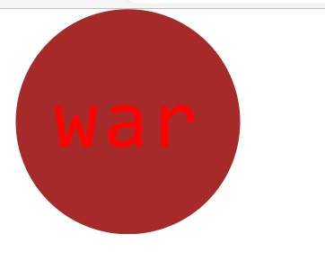
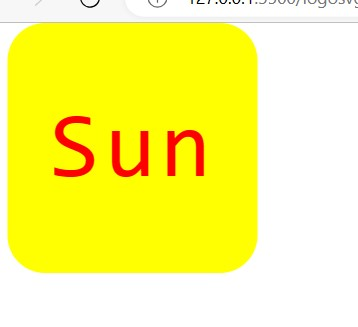

# logomaker

<bisrat mengesha>

#description
this project produce logo 
with svg and node writing 

it downlod the following node package
node (node install)
color package
jest test package

it has different file of 
js based on the shape

svg creator js (it has function return the svg)

shape js (gives us shape option)

test result pictures

created logos pictures

clone link
git@github.com:Hellobisrat/logomaker.git

repository 
https://github.com/Hellobisrat/logomaker

vedio link
https://drive.google.com/file/d/1DRoSwZcZ29tUxyz98ILTDfoXxs_zhHTz/view

